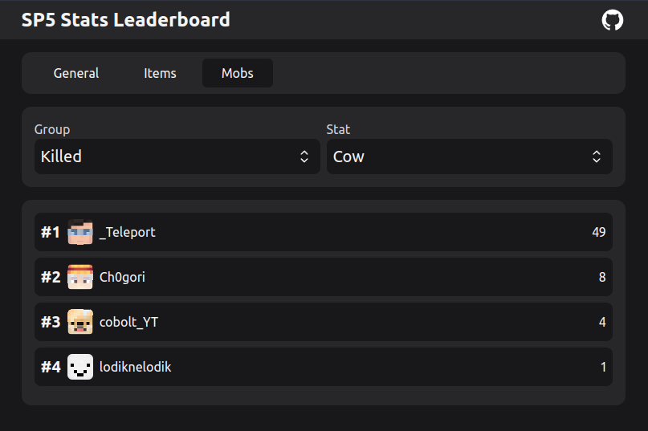

# Minecraft Stats Leaderboard

> This is beta software, bugs are expected. Please open an issue if you find any.

View statistics leaderboards for your Minecraft worlds or server in the browser. This software parses your minecraft world statistics data, allowing you to view them in a user-friendly way. Find out who played the most on your server, who placed the most cobblestone, who crafted the most shovels, who killed the most cows etc.

<p align="center">
  
</p>

## How to use?

### Run with Docker

```bash
docker run -d \
  -p 3000:3000 \
  -e SERVER_NAME="My Server" \
  -v /path/to/worlds/stats:/data \
  ronanru/mc_stats_leaderboard
```

### Run standalone

- Download the latest version from [GitHub Releases](https://github.com/ronanru/mc_stats_leaderboard/releases/)
- Launch `./mc_stats_leaderboard ./path/to/world/stats` on your Linux server
- Go to `http://YOUR_SERVER_IP:3000`
- Check out `./mc_stats_leaderboard --help` for other options

### Build from source

You need `rust`, `cargo`, `node` and `pnpm` to build.

- Clone the repo
- Run the build script `./build.sh`
- Get the binary in `./target/release/mc_stats_leaderboard`
